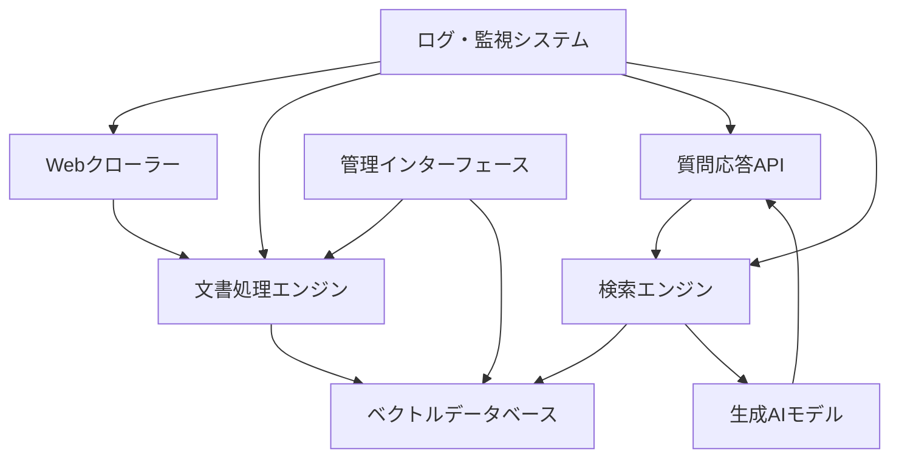

# 設計書

## 概要

スパコン運用支援RAGシステムは、九州大学情報基盤研究開発センターのスーパーコンピュータに関する質問応答を提供するシステムです。文書収集、インデックス作成、検索、回答生成の各機能を統合し、オンプレミス環境で完全に動作します。

## アーキテクチャ

システムは以下の主要コンポーネントで構成されます：



### アーキテクチャの特徴

- **マイクロサービス型設計**: 各コンポーネントが独立して動作
- **オンプレミス完結**: 外部APIに依存しない自己完結型システム
- **スケーラブル**: 文書量の増加に対応可能な設計
- **監視可能**: 全コンポーネントの動作状況を追跡

## コンポーネントとインターフェース

### 1. Webクローラー
- **責任**: 指定されたWebサイトから文書を自動収集
- **インターフェース**: 
  - `crawl_website(url: str) -> List[Document]`
  - `extract_text_from_html(html: str) -> str`
  - `filter_japanese_content(text: str) -> str`

### 2. 文書処理エンジン
- **責任**: 文書のチャンク分割、埋め込みベクトル生成、インデックス管理
- **インターフェース**:
  - `process_document(document: Document) -> List[Chunk]`
  - `generate_embeddings(chunks: List[Chunk]) -> List[Vector]`
  - `update_index(chunks: List[Chunk], vectors: List[Vector]) -> bool`

### 3. ベクトルデータベース
- **責任**: 埋め込みベクトルと文書チャンクの永続化
- **インターフェース**:
  - `store_vectors(vectors: List[Vector], metadata: List[Metadata]) -> bool`
  - `search_similar(query_vector: Vector, top_k: int) -> List[SearchResult]`
  - `delete_by_document_id(document_id: str) -> bool`

### 4. 検索エンジン
- **責任**: 質問に対する関連文書の検索
- **インターフェース**:
  - `search(query: str) -> List[SearchResult]`
  - `rank_results(results: List[SearchResult]) -> List[SearchResult]`

### 5. 生成AIモデル
- **責任**: 検索結果に基づく回答生成
- **インターフェース**:
  - `generate_answer(query: str, context: List[str]) -> Answer`
  - `load_local_model(model_path: str) -> Model`

### 6. 質問応答API
- **責任**: ユーザーインターフェースの提供
- **インターフェース**:
  - `POST /api/question` - 質問の受付と回答の返却
  - `GET /api/health` - システム状態の確認

## データモデル

### Document
```python
@dataclass
class Document:
    id: str
    url: str
    title: str
    content: str
    language: str
    created_at: datetime
    updated_at: datetime
```

### Chunk
```python
@dataclass
class Chunk:
    id: str
    document_id: str
    content: str
    position: int
    embedding: Optional[List[float]]
```

### SearchResult
```python
@dataclass
class SearchResult:
    chunk: Chunk
    score: float
    document: Document
```

### Answer
```python
@dataclass
class Answer:
    text: str
    sources: List[str]
    confidence: float
    processing_time: float
```

## 正確性プロパティ

*プロパティとは、システムの全ての有効な実行において真であるべき特性や動作のことです。これは人間が読める仕様と機械で検証可能な正確性保証の橋渡しとなります。*

### プロパティ1: 質問応答の一貫性
*任意の*日本語質問に対して、RAGシステムは関連文書を検索して回答を生成する必要がある
**検証対象: 要件 1.1**

### プロパティ2: 検索結果の関連性
*任意の*質問に対して、関連文書が存在する場合、検索された文書に基づいて正確な回答が提供される必要がある
**検証対象: 要件 1.2**

### プロパティ3: ソース情報の明示
*任意の*回答生成において、参照した文書のソース情報が明示される必要がある
**検証対象: 要件 1.4**

### プロパティ4: 複数文書の統合
*任意の*複数の関連文書が存在する質問に対して、最も関連性の高い情報が統合された回答が生成される必要がある
**検証対象: 要件 1.5**

### プロパティ5: 文書インデックス作成
*任意の*新しい文書に対して、チャンクに分割されてインデックスに追加される必要がある
**検証対象: 要件 2.1**

### プロパティ6: インデックス更新の一貫性
*任意の*既存文書の更新において、古いインデックスが削除されて新しいインデックスが作成される必要がある
**検証対象: 要件 2.2**

### プロパティ7: インデックス削除の完全性
*任意の*文書削除において、対応するインデックスが完全に削除される必要がある
**検証対象: 要件 2.3**

### プロパティ8: 処理ログの記録
*任意の*文書処理において、処理結果がログに記録される必要がある
**検証対象: 要件 2.4**

### プロパティ9: HTMLテキスト抽出
*任意の*HTMLページに対して、本文テキストが正しく抽出される必要がある
**検証対象: 要件 3.2**

### プロパティ10: 日本語コンテンツフィルタリング
*任意の*多言語コンテンツに対して、日本語コンテンツのみが処理対象となる必要がある
**検証対象: 要件 3.3**

### プロパティ11: Webサイト構造変更への対応
*任意の*Webサイト構造変更に対して、変更を検出して適切に処理される必要がある
**検証対象: 要件 3.4**

### プロパティ12: ローカル埋め込みモデル使用
*任意の*テキストに対して、埋め込みベクトル生成時にローカルの言語モデルが使用される必要がある
**検証対象: 要件 4.2**

### プロパティ13: ローカルストレージ使用
*任意の*文書保存において、ローカルのデータベースまたはファイルシステムが使用される必要がある
**検証対象: 要件 4.3**

### プロパティ14: ローカル生成モデル使用
*任意の*質問応答処理において、ローカルの生成AIモデルが使用される必要がある
**検証対象: 要件 4.4**

### プロパティ15: 検索スコア記録
*任意の*検索クエリ実行において、検索結果の関連度スコアが記録される必要がある
**検証対象: 要件 5.1**

### プロパティ16: チャンク情報記録
*任意の*回答生成において、使用された文書チャンクの情報が記録される必要がある
**検証対象: 要件 5.2**

### プロパティ17: ログ情報の完全性
*任意の*ログ出力において、処理時間と使用リソースが記録される必要がある
**検証対象: 要件 5.4**

## エラーハンドリング

### 1. ネットワークエラー
- **戦略**: 指数バックオフによる再試行
- **実装**: 最大3回の再試行、エラーログの記録
- **フォールバック**: キャッシュされた文書の使用

### 2. 文書処理エラー
- **戦略**: 部分的な処理継続
- **実装**: エラーが発生した文書をスキップして処理継続
- **ログ**: 詳細なエラー情報の記録

### 3. モデル読み込みエラー
- **戦略**: デフォルトモデルへのフォールバック
- **実装**: 軽量なバックアップモデルの使用
- **通知**: 管理者への警告通知

### 4. ストレージエラー
- **戦略**: 一時的なメモリ保存
- **実装**: インメモリキャッシュの活用
- **復旧**: 定期的な保存処理の再試行

## テスト戦略

### 単体テスト
- 各コンポーネントの個別機能テスト
- モックを使用した依存関係の分離
- エラーケースの網羅的テスト

### プロパティベーステスト
- 正確性プロパティの検証
- ランダムな入力データでの動作確認
- 境界値での動作テスト
- 最小100回の反復実行による検証

### 統合テスト
- コンポーネント間の連携テスト
- エンドツーエンドの動作確認
- 実際のWebサイトを使用したテスト

### 性能テスト
- 大量文書での処理性能測定
- 同時アクセス時の応答性能確認
- メモリ使用量の監視