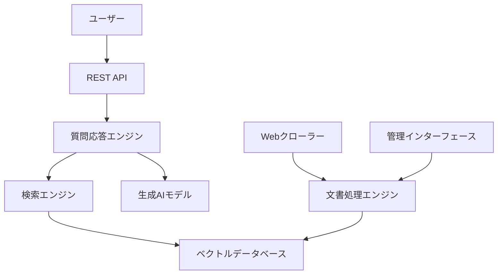

# スーパーコンピュータ運用支援RAGシステム

九州大学情報基盤研究開発センターのスーパーコンピュータ運用支援のためのRAG（Retrieval-Augmented Generation）システムです。

## 🚀 概要

本システムは、スーパーコンピュータの利用者からの質問に対して、システム説明、運用ポリシー、接続方法、バッチスクリプトの書き方、バッチキューの説明、アカウントの作り方、使用料金説明、設定方法などの情報を自動的に提供するRAGシステムです。

### 主な特徴

- 🤖 **自然言語質問応答**: 日本語での質問に対する適切な回答生成
- 🌐 **自動文書収集**: 九州大学SCPサイトからの文書自動収集
- 🔍 **意味的検索**: ベクトル検索による関連文書の高精度検索
- 🏠 **オンプレミス完結**: 外部サービスに依存しない完全ローカル動作
- 📊 **管理インターフェース**: 文書管理とシステム監視機能

## 📋 システム要件

### ハードウェア要件
- **CPU**: 4コア以上推奨（最小2コア）
- **メモリ**: 8GB以上推奨（最小4GB）
- **ストレージ**: 50GB以上の空き容量

### ソフトウェア要件
- **OS**: Linux (Ubuntu 20.04+, CentOS 8+) または macOS
- **Docker**: 20.10以降
- **Docker Compose**: 2.0以降
- **Python**: 3.11以降（Dockerを使用しない場合）

## 🛠️ クイックスタート

### Docker Compose（推奨）

```bash
# 1. リポジトリのクローン
git clone <repository-url>
cd supercomputer-support-rag

# 2. セットアップ
./scripts/setup.sh --docker

# 3. 環境設定
cp .env.example .env
# 必要に応じて .env を編集

# 4. システム起動
docker-compose up -d

# 5. 動作確認
curl http://localhost:8000/health
```

### Python仮想環境

```bash
# 1. セットアップ
./scripts/setup.sh

# 2. 仮想環境の有効化
source .venv/bin/activate

# 3. システム起動
python run_api.py
```

## 📖 使用方法

### API経由での質問

```bash
curl -X POST http://localhost:8000/api/question \
  -H "Content-Type: application/json" \
  -d '{"question": "スパコンのアカウント作成方法は？"}'
```

### 管理インターフェース

```bash
# 管理インターフェースの起動
python demo_management.py
```

### 文書の収集とインデックス作成

```bash
# APIを使用した文書収集
curl -X POST http://localhost:8000/api/management/crawl \
  -H "Content-Type: application/json" \
  -d '{"url": "https://www.cc.kyushu-u.ac.jp/scp/"}'
```

## 🧪 テスト

```bash
# 単体テストの実行
python -m pytest tests/ -v

# 統合テストの実行
python integration_test.py

# システム統合チェック
python system_integration_check.py

# オフライン動作確認
python verify_offline.py
```

## 📊 監視とメンテナンス

### システム監視

```bash
# リアルタイム監視ダッシュボード
./scripts/monitor.sh

# 個別チェック
./scripts/monitor.sh status    # システム状態
./scripts/monitor.sh health    # APIヘルスチェック
./scripts/monitor.sh resources # リソース使用状況
```

### バックアップ

```bash
# バックアップの作成
./scripts/backup.sh

# バックアップの確認
ls -la backups/
```

## 🏗️ アーキテクチャ



詳細なアーキテクチャについては [docs/ARCHITECTURE.md](docs/ARCHITECTURE.md) を参照してください。

## 📚 ドキュメント

- [インストールガイド](docs/INSTALLATION.md) - 詳細なインストール手順
- [運用マニュアル](docs/OPERATION.md) - 日常運用とメンテナンス
- [API仕様書](docs/API.md) - REST API の詳細仕様
- [アーキテクチャ](docs/ARCHITECTURE.md) - システム設計と技術詳細

## 🔧 設定

### 主要設定項目（config.yaml）

```yaml
embedding:
  model_name: "intfloat/multilingual-e5-base"
  model_path: "./models/embedding"

generation:
  model_name: "rinna/japanese-gpt-neox-3.6b"
  model_path: "./models/generation"

crawling:
  base_url: "https://www.cc.kyushu-u.ac.jp/scp/"
  max_depth: 3
  delay: 1.0

search:
  top_k: 5
  min_score: 0.5
```

### 環境変数（.env）

```bash
API_PORT=8000
LOG_LEVEL=INFO
EMBEDDING_MODEL_NAME=intfloat/multilingual-e5-base
MAX_WORKERS=4
BATCH_SIZE=32
```

## 🚀 本番環境デプロイ

### Docker Compose（本番環境）

```bash
# 本番環境用設定でデプロイ
./scripts/deploy.sh prod

# Nginxリバースプロキシ付きでデプロイ
docker-compose -f docker-compose.prod.yml --profile with-nginx up -d
```

### 監視とアラート

```bash
# システム監視の開始
./scripts/monitor.sh

# ログの確認
docker-compose logs -f rag-system
```

## 🔍 トラブルシューティング

### よくある問題

1. **メモリ不足エラー**
   ```bash
   # Docker Composeのメモリ制限を増加
   # docker-compose.yml の memory 設定を調整
   ```

2. **ポート競合**
   ```bash
   # 別のポートを使用
   export API_PORT=8001
   docker-compose up -d
   ```

3. **モデルダウンロードエラー**
   ```bash
   # 手動でモデルをダウンロード
   python -c "
   from transformers import AutoModel, AutoTokenizer
   model_name = 'intfloat/multilingual-e5-base'
   AutoModel.from_pretrained(model_name, cache_dir='./models/embedding')
   "
   ```

詳細なトラブルシューティングは [docs/INSTALLATION.md](docs/INSTALLATION.md) を参照してください。

## 📈 パフォーマンス

| 操作 | 目標時間 | 実測値 |
|------|----------|--------|
| 質問応答 | < 5秒 | 2-4秒 |
| 文書検索 | < 1秒 | 0.5-1秒 |
| インデックス作成 | < 30秒/文書 | 15-25秒 |

## 🤝 コントリビューション

1. このリポジトリをフォーク
2. フィーチャーブランチを作成 (`git checkout -b feature/amazing-feature`)
3. 変更をコミット (`git commit -m 'Add amazing feature'`)
4. ブランチにプッシュ (`git push origin feature/amazing-feature`)
5. プルリクエストを作成

## 📄 ライセンス

このプロジェクトはMITライセンスの下で公開されています。詳細は [LICENSE](LICENSE) ファイルを参照してください。

## 🙏 謝辞

- 九州大学情報基盤研究開発センター
- Hugging Face Transformers
- FastAPI コミュニティ

## 📞 サポート

- 技術サポート: [サポート連絡先]
- ドキュメント: [ドキュメントURL]
- 問題報告: [Issue Tracker URL]