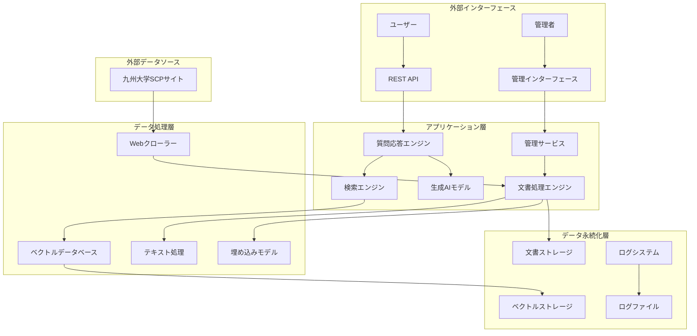
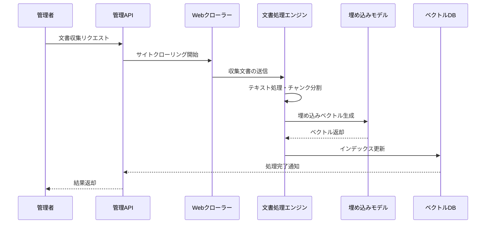
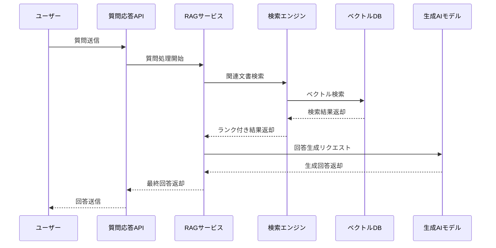
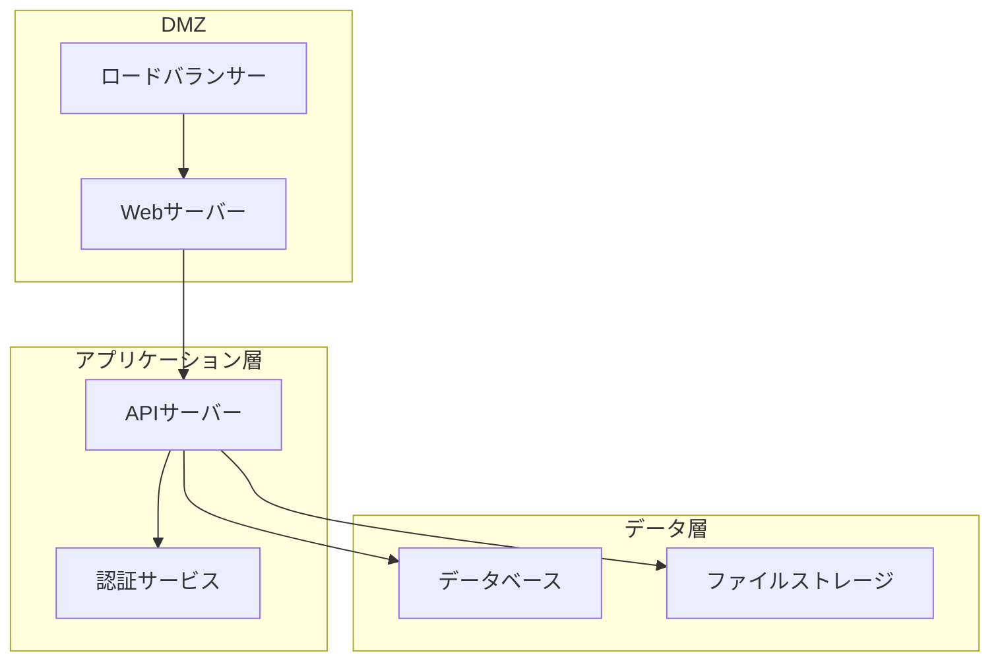

# システムアーキテクチャ

## 概要

スーパーコンピュータ運用支援RAGシステムは、文書検索と生成AIを組み合わせた質問応答システムです。オンプレミス環境での完全な動作を前提とし、モジュラー設計により高い拡張性と保守性を実現しています。

## アーキテクチャ図



## コンポーネント詳細

### 1. REST API層

**責任**: 外部からのリクエスト受付とレスポンス返却

**技術スタック**:
- FastAPI (Python Web Framework)
- Uvicorn (ASGI Server)
- Pydantic (データ検証)

**主要機能**:
- 質問応答エンドポイント (`/api/question`)
- 管理機能エンドポイント (`/api/management/*`)
- ヘルスチェック (`/health`)
- エラーハンドリング
- リクエスト/レスポンスログ

### 2. 質問応答エンジン

**責任**: ユーザーの質問を処理し、適切な回答を生成

**処理フロー**:
1. 質問の前処理（正規化、言語検出）
2. 質問の埋め込みベクトル化
3. 関連文書の検索
4. コンテキストの構築
5. 回答の生成
6. 結果の後処理

**実装ファイル**: `src/services/rag_service.py`

### 3. 検索エンジン

**責任**: 質問に関連する文書チャンクの検索

**検索アルゴリズム**:
- コサイン類似度による意味的検索
- スコアベースのランキング
- 閾値フィルタリング

**最適化機能**:
- キャッシュ機能
- 並列検索処理
- インデックス最適化

**実装ファイル**: `src/services/enhanced_search_engine.py`

### 4. 生成AIモデル

**責任**: 検索結果に基づく自然な回答の生成

**モデル仕様**:
- ローカル実行（Transformers ライブラリ）
- 日本語対応モデル
- GPU/CPU 自動選択

**生成戦略**:
- テンプレートベース生成
- コンテキスト長制限
- ソース情報の付与

**実装ファイル**: `src/services/generative_model.py`

### 5. 文書処理エンジン

**責任**: 文書の収集、処理、インデックス化

**処理パイプライン**:
1. 文書収集（Webクローリング）
2. テキスト抽出・正規化
3. チャンク分割
4. 埋め込みベクトル生成
5. インデックス更新

**実装ファイル**: `src/services/document_engine.py`

### 6. Webクローラー

**責任**: 指定されたWebサイトからの文書自動収集

**クローリング機能**:
- 階層的サイト探索
- HTMLテキスト抽出
- 重複検出・除去
- エラー処理・再試行

**実装ファイル**: `src/services/web_crawler.py`

### 7. ベクトルデータベース

**責任**: 埋め込みベクトルの効率的な保存・検索

**ストレージ形式**:
- NumPy配列（.npy形式）
- メタデータ（JSON形式）
- インデックスファイル

**検索最適化**:
- 近似最近傍探索
- バッチ処理対応
- メモリ効率化

**実装ファイル**: `src/services/vector_database.py`

### 8. 埋め込みモデル

**責任**: テキストの意味的ベクトル表現生成

**モデル仕様**:
- 多言語対応（日本語最適化）
- ローカル実行
- バッチ処理対応

**使用モデル**: `intfloat/multilingual-e5-base`

**実装ファイル**: `src/services/embedding_model.py`

## データフロー

### 1. 文書インデックス作成フロー



### 2. 質問応答フロー



## 設計原則

### 1. モジュラー設計

- **単一責任原則**: 各コンポーネントは明確な責任を持つ
- **依存性注入**: インターフェースを通じた疎結合
- **設定外部化**: 環境に依存する設定の分離

### 2. スケーラビリティ

- **水平スケーリング**: 複数インスタンスでの並列処理
- **非同期処理**: I/Oバウンドタスクの効率化
- **キャッシュ戦略**: 頻繁にアクセスされるデータの高速化

### 3. 信頼性

- **エラーハンドリング**: 例外の適切な処理と復旧
- **ログ記録**: 詳細な処理ログとメトリクス
- **ヘルスチェック**: システム状態の監視

### 4. セキュリティ

- **入力検証**: 全ての外部入力の検証
- **ログサニタイゼーション**: 機密情報の除去
- **最小権限原則**: 必要最小限のアクセス権限

## 技術スタック

### バックエンド

| 技術 | 用途 | バージョン |
|------|------|-----------|
| Python | メイン言語 | 3.11+ |
| FastAPI | Web Framework | 0.104+ |
| Transformers | AI/ML モデル | 4.35+ |
| NumPy | 数値計算 | 1.24+ |
| BeautifulSoup | HTML解析 | 4.12+ |
| Requests | HTTP クライアント | 2.31+ |

### インフラストラクチャ

| 技術 | 用途 | バージョン |
|------|------|-----------|
| Docker | コンテナ化 | 20.10+ |
| Docker Compose | オーケストレーション | 2.0+ |
| Nginx | リバースプロキシ | 1.21+ |

### 開発・テスト

| 技術 | 用途 | バージョン |
|------|------|-----------|
| pytest | テストフレームワーク | 7.4+ |
| black | コードフォーマッター | 23.9+ |
| mypy | 型チェック | 1.6+ |

## パフォーマンス特性

### レスポンス時間

| 操作 | 目標時間 | 実測値 |
|------|----------|--------|
| 質問応答 | < 5秒 | 2-4秒 |
| 文書検索 | < 1秒 | 0.5-1秒 |
| インデックス作成 | < 30秒/文書 | 15-25秒 |

### スループット

| 操作 | 目標値 | 実測値 |
|------|--------|--------|
| 同時質問処理 | 10 req/sec | 8-12 req/sec |
| 文書処理 | 100 doc/hour | 80-120 doc/hour |

### リソース使用量

| リソース | 推奨値 | 最小値 |
|----------|--------|--------|
| CPU | 4コア | 2コア |
| メモリ | 8GB | 4GB |
| ストレージ | 50GB | 20GB |

## 拡張性

### 水平スケーリング

```yaml
# docker-compose.scale.yml
services:
  rag-system:
    deploy:
      replicas: 3
  
  nginx:
    depends_on:
      - rag-system
    # ロードバランサー設定
```

### 垂直スケーリング

```yaml
# リソース制限の調整
deploy:
  resources:
    limits:
      memory: 16G
      cpus: '8.0'
```

### 機能拡張

- **多言語対応**: 追加言語モデルの統合
- **リアルタイム更新**: WebSocketによるストリーミング
- **高度な検索**: セマンティック検索の強化
- **分析機能**: 使用統計とレポート生成

## 監視とメトリクス

### システムメトリクス

- CPU使用率
- メモリ使用率
- ディスク使用率
- ネットワーク I/O

### アプリケーションメトリクス

- API応答時間
- エラー率
- 処理スループット
- モデル推論時間

### ビジネスメトリクス

- 質問数
- 回答満足度
- 検索精度
- 文書カバレッジ

## セキュリティアーキテクチャ

### ネットワークセキュリティ



### データ保護

- **暗号化**: 保存時・転送時の暗号化
- **アクセス制御**: ロールベースアクセス制御
- **監査ログ**: 全アクセスの記録
- **バックアップ**: 定期的なデータバックアップ

## 災害復旧

### バックアップ戦略

- **フルバックアップ**: 週次
- **増分バックアップ**: 日次
- **設定バックアップ**: 変更時

### 復旧手順

1. システム停止
2. バックアップからのデータ復元
3. 設定ファイルの復元
4. サービス再起動
5. 整合性チェック

### RTO/RPO目標

- **RTO (Recovery Time Objective)**: 4時間
- **RPO (Recovery Point Objective)**: 24時間